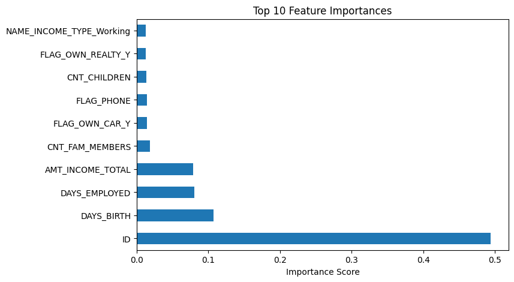
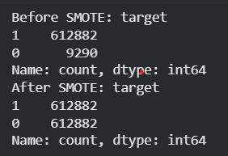

# 📊 Credit Card Approval Prediction using Machine Learning

## 📌 Project Overview
This project builds an end-to-end machine learning pipeline to predict whether a credit card application should be approved based on applicant demographic, financial, and credit history data.

The focus is on handling real-world challenges such as class imbalance, data leakage prevention, and business-oriented evaluation.

---

## 🧠 Business Problem
Financial institutions must accurately assess credit risk while minimizing losses from risky approvals.

Key challenges addressed:
- Highly imbalanced datasets
- Meaningful evaluation beyond accuracy
- Balancing business risk trade-offs

---

## 📂 Dataset Description
The project uses publicly available credit datasets:

- **application_record.csv**  
  Contains applicant demographic and financial information.

- **credit_record.csv**  
  Contains historical credit repayment behavior.

The datasets are merged using a common applicant ID to form a unified dataset.

---

## ⚙️ Machine Learning Pipeline

### 1️⃣ Data Preprocessing
- Merged multiple datasets
- Created binary target variable from repayment status
- Handled missing values
- Removed identifier (`ID`) to prevent data leakage
- One-hot encoded categorical features

### 2️⃣ Exploratory Analysis
- Identified severe class imbalance
- Analyzed feature distributions and correlations

---

## 🤖 Models Used
- Logistic Regression (baseline)
- Random Forest Classifier

---

## ⚠️ Handling Class Imbalance
To address imbalance:
- Applied **SMOTE (Synthetic Minority Oversampling Technique)** on training data
- Focused on recall, F1-score, and ROC-AUC instead of accuracy

---

## 📈 Evaluation Metrics
- Precision
- Recall
- F1-score
- Accuracy
- ROC-AUC

**Final ROC-AUC:** ~0.88

---

## 🎯 Threshold Tuning
- Tuned classification threshold to 0.3
- Improved minority-class recall
- Balanced false positives vs false negatives based on business risk

---

## 🖼️ Results & Visualizations
Screenshots of key outputs are available in the `screenshots/` folder:
- ROC Curve
- Feature Importance Plot
- Classification Reports

### ROC Curve

### Feature Importance

### SMOTE Results

---

## 🏆 Key Outcomes
- Built ML pipeline on ~770K records
- Improved minority-class recall from ~7% to ~69%
- Demonstrated business-aligned model optimization

---

## 🔮 Future Improvements
- Cost-sensitive learning
- Hyperparameter tuning
- SHAP-based explainability
- Model deployment using Streamlit or FastAPI

---

## 🛠️ Tech Stack
- Python
- Pandas, NumPy
- Scikit-learn
- Imbalanced-learn (SMOTE)
- Matplotlib, Seaborn
- Google Colab

---

## 🙋‍♀️ Author
**Anushka Shanker**  
B.Tech (ECE - AI)  
Data Science & AI Enthusiast
